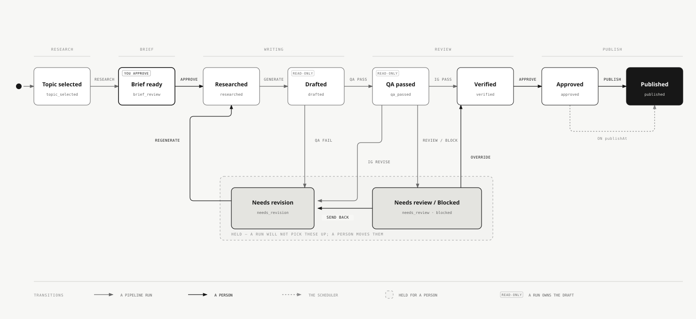

# Datum

Datum is an SEO content pipeline built on [Payload CMS](https://payloadcms.com/). It finds content-gap keywords, drafts articles from reusable templates, and checks each draft before publication.

## Why Datum is different

Datum makes its editorial rules visible and editable. Editors set template rules in Payload. Maintainers keep shared rules in [`docs/style-guide.md`](docs/style-guide.md). The generator and QA checks read both.

Before an editor can approve a draft, Datum checks its structure and readability without an LLM. One model call fact-checks claims with web search. A second reviews the writing against the template and style guide. Datum records tokens and cost for responses that parse successfully. Responses that fail JSON parsing are not yet recorded.

Everything runs in your Payload and Postgres setup under the MIT license. If a rule is wrong, edit it. If a draft fails, the QA results say which check rejected it.

## Workspaces

| Path | Role |
| --- | --- |
| [`cms/`](cms/) | Payload CMS 3 app using Next.js 16 and Postgres. Stores templates and articles and provides the admin UI. |
| [`pipeline/`](pipeline/) | Node/TypeScript CLI that advances articles through research → generate → QA |
| [`docs/`](docs/) | Style guide and other content rules that the pipeline reads |

`cms` and `pipeline` share one Postgres database and the types generated in `cms/src/payload-types.ts`. The pipeline imports Payload in the same process. It does not call the CMS over HTTP.

## Article status flow



Assign a template in the admin UI or with `pipeline/scripts/assign-template.ts`. The pipeline does not process `needs_revision` articles. Reset one to `drafted` to run QA again. The editable [diagram source](docs/diagrams/article-status-flow.html) lives beside the SVG.

## Prerequisites

- Node.js 22+
- npm with workspaces. You do not need pnpm for daily use.
- Docker for local Postgres through Docker Compose

## Quick start

```bash
# 1. Env files
cp .env.example .env
cp cms/.env.example cms/.env
# Generate a Payload secret:
#   openssl rand -hex 32
# Set PAYLOAD_SECRET in both .env files, or at least in cms/.env.

# 2. Database
docker compose up -d

# 3. Install & seed
npm install
npm run seed

# 4. Admin UI
npm run dev
# → http://localhost:3000
```

### Seeded local admin

The seed creates this account for local development. Change its password before using Datum in a shared or deployed environment.

- Email: `admin@datum.local`
- Password: value of `SEED_ADMIN_PASSWORD`, or `datum-dev-password` if unset

### Pipeline mock mode

Mock mode needs no API keys. Set `MOCK_MODE=true`, as shown in `.env.example`, and Datum uses fixtures instead of calling Ahrefs or Anthropic.

```bash
npm run pipeline:fetch -- --count 3
# Assign a template in admin or:
#   npx tsx pipeline/scripts/assign-template.ts <articleId> Listicle
npm run pipeline:run
npm run pipeline:report -- --period week
```

For live API calls, set `MOCK_MODE=false` and provide `ANTHROPIC_API_KEY`. Ahrefs also needs `AHREFS_API_KEY`, `TARGET_DOMAIN`, and `COMPETITOR_DOMAINS`. See [`.env.example`](.env.example).

## Environment variables

Copy [`.env.example`](.env.example) and [`cms/.env.example`](cms/.env.example). The pipeline loads `cms/.env` first and the root `.env` second. Environment variables set in the shell override both files.

| Variable | Purpose |
| --- | --- |
| `DATABASE_URL` | Postgres connection string |
| `PAYLOAD_SECRET` | Payload token signing secret |
| `ANTHROPIC_API_KEY` | Claude for generation and QA. Not required in mock mode. |
| `AHREFS_API_KEY` | Keyword and SERP research. Not required in mock mode. |
| `TARGET_DOMAIN` | Domain that will publish the articles |
| `COMPETITOR_DOMAINS` | Comma-separated competitors for content-gap fetch |
| `MOCK_MODE` | `true` to use fixtures instead of paid APIs |
| `SEED_ADMIN_PASSWORD` | Password for the seeded admin user |

## Root scripts

| Script | Description |
| --- | --- |
| `npm run dev` | CMS Next.js dev server |
| `npm run seed` | Create or update templates and the admin user |
| `npm run pipeline:fetch` | Create articles from content-gap keywords |
| `npm run pipeline:run` | Run research → generate → QA for eligible articles |
| `npm run pipeline:report` | Print the QA and spending report |
| `npm run typecheck` / `lint` / `test` | Workspace checks described in [CONTRIBUTING.md](CONTRIBUTING.md) |

## Documentation

- [CONTRIBUTING.md](CONTRIBUTING.md) covers setup, tests, and pull request expectations.
- [SECURITY.md](SECURITY.md) explains how to report a vulnerability.
- [CODE_OF_CONDUCT.md](CODE_OF_CONDUCT.md)
- [CLAUDE.md](CLAUDE.md) documents the architecture for contributors and coding agents.
- [docs/style-guide.md](docs/style-guide.md) contains the editorial rules and banned phrases checked by QA.
- [docs/open-source-checklist.md](docs/open-source-checklist.md) lists the maintainer steps for making the repository public.

Agent helpers live under `.claude/` and `vendor/claude-plugins/`. Datum runs without them.

## License

[MIT](LICENSE) © 2026
