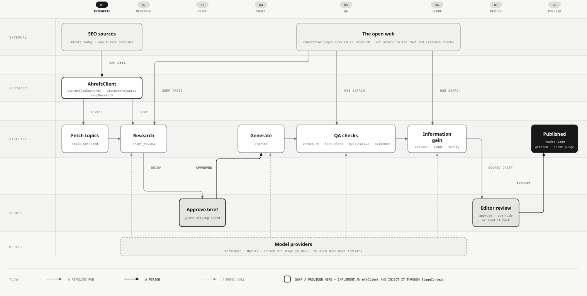
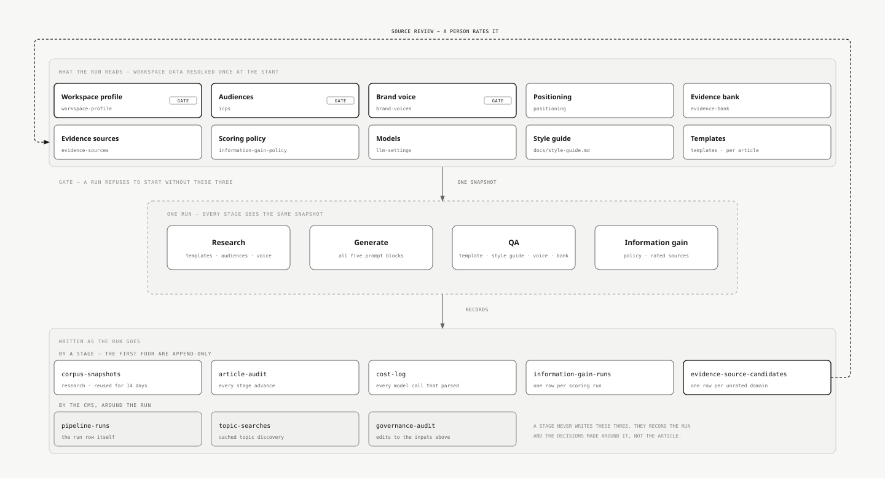

# Datum

[](https://github.com/snowopsdev/datum/actions/workflows/ci.yml)
[](https://github.com/snowopsdev/datum/releases)
[](LICENSE)

Datum is an SEO content pipeline built on [Payload CMS](https://payloadcms.com/). It finds content-gap keywords, drafts articles from reusable templates, and checks each draft before publication.

## Why Datum is different

Datum makes its editorial rules visible and editable. Editors set template rules in Payload. Maintainers keep shared rules in [`docs/style-guide.md`](docs/style-guide.md). The generator and QA checks read both.

Before an editor can approve a draft, Datum checks its structure and readability without an LLM. Three model calls follow: one fact-checks claims against the open web, one reviews the writing against the template, the style guide and your brand voice, and one checks every claim the draft makes about you against an evidence bank you control. Datum records tokens and cost for responses that parse successfully. Responses that fail JSON parsing are not yet recorded.

Everything runs in your Payload and Postgres setup under the MIT license. If a rule is wrong, edit it. If a draft fails, the QA results say which check rejected it.

## Workspaces

| Path | Role |
| --- | --- |
| [`cms/`](cms/) | Payload CMS 3 app using Next.js 16 and Postgres. Stores templates and articles and provides the admin UI. |
| [`pipeline/`](pipeline/) | Node/TypeScript CLI that advances articles through research → generate → QA → scoring |
| [`docs/`](docs/) | Style guide and other content rules that the pipeline reads, plus [`docs/operations.md`](docs/operations.md) for queues, webhooks, caching, and limits |

`cms` and `pipeline` share one Postgres database and the types generated in `cms/src/payload-types.ts`. The pipeline imports Payload in the same process. It does not call the CMS over HTTP.

## Pipeline and data integration



External SEO data is isolated behind the `AhrefsClient` contract, which has three methods: `contentGapKeywords` and `discoverKeywords` find topics, and `serpResearch` reads a keyword's live results page. To add another provider, implement that interface and inject it through `StageContext`; topic discovery and SERP research consume the normalized results. Model calls are routed through one adapter of their own, picked per stage from the model id, so no stage has to choose one. The editable [diagram source](docs/diagrams/pipeline-data-flow.html) lives beside the SVG.

### What a run reads and writes



A run resolves your workspace's own facts once, before the first stage, so activating an audience halfway through a batch cannot change what the second article was written against. Templates are the exception: each stage re-reads the one attached to the article it is working on. Three of these gate the run — without an active brand voice, a target domain and at least one active audience it refuses to start. As it goes it writes append-only rows for model costs, stage audits and information-gain scores, a corpus snapshot it may re-cluster later, and a review-queue row for every domain it cited that nobody has rated yet, updated in place when the same domain turns up again. The editable [diagram source](docs/diagrams/run-inputs-and-records.html) lives beside the SVG.

## Article status flow


Research ends at **`brief_review`**: Datum writes a brief from the template, the research gaps and your brand voice, and waits. Approving the brief is what starts writing, checks and scoring, so the decision lands before the expensive half rather than after it. Research is not free — it makes a paid SERP request and extracts claims from what already ranks — but the brief is where you stop the far larger writing and review spend. The pipeline never picks up `brief_review`, `needs_revision`, `needs_review` or `blocked` on its own; those are yours. Publishing is yours too, unless you set a `publishAt` date on an approved article, in which case the scheduler publishes it through the same gates and audit trail. Its cache purge is the one difference: a manual publish purges in process, while a scheduled one rides the revalidate webhook, so point `WEBHOOK_URL` at `<SITE_URL>/hooks/revalidate` or the reader page can serve stale for up to 300 seconds. See [`docs/operations.md`](docs/operations.md). The editable [diagram source](docs/diagrams/article-status-flow.html) lives beside the SVG.

## Setup and governance

Everything that decides how Datum writes lives under **Setup** in the admin nav, and a run reads all of it once before its first stage.

- **Setup checklist** (`/admin/ops/setup`) — five steps, and `/admin` keeps showing it until the three required ones are done and the workspace holds at least one piece. Three are required, and a content run refuses to start without them: a workspace with a target domain (`/admin/ops/setup/workspace`), an active brand voice, and at least one active audience (`/admin/ops/setup/audiences`). Two are recommended and change what a draft may claim: your positioning (`/admin/ops/setup/positioning`) and an evidence bank (`/admin/ops/setup/evidence`). The workspace, audience and positioning steps each have **Draft with AI** and **Refine with AI**, and the evidence bank offers the assistant on two of its three tabs; every reply drafts one section of one asset, so you read it before accepting it. They work from your own site: **Fetch site pages** reads your home page and up to seven marketing pages linked from it. **Start with the demo workspace** fills all five in one click. See [`docs/tenant-context.md`](docs/tenant-context.md).
- **Brand voice** (`/admin/ops/governance/brand-voice`) — a workspace-wide voice every generated title, description, FAQ, and body follows, layered on top of `docs/style-guide.md`. Set it up with a nine-step onboarding stepper or by uploading an existing brand guide (`.md`/`.txt`/`.pdf`/`.docx`) for one-call extraction into a draft you review before activating. An active voice is required for content runs. Seed a demo voice with `npm run seed -- --with-brand-voice`.
- **Models** (`/admin/globals/llm-settings`) — nine choices: one for each of the seven pipeline stages that call a model (generate, fact check, qualitative review, claim extraction, information-gain judge, evidence verification, evidence check), plus brand-voice extraction and the setup assistant. Pick a model here, or leave it blank to fall back to the matching `PIPELINE_MODEL_*` / `BRAND_VOICE_EXTRACT_MODEL` / `SETUP_ASSIST_MODEL` env var, or to `claude-opus-5` if neither is set. Each model needs its provider's API key (`ANTHROPIC_API_KEY` for `claude-*`, `OPENAI_API_KEY` for `gpt-*`, `o`-numbered and `chatgpt-*` models) wherever that call runs; see the env var split below. A `codex/*` model (for example `codex/gpt-5.6-terra`) needs no key. It runs through your own Codex CLI login on that host instead; see [Using your ChatGPT plan (Codex)](#using-your-chatgpt-plan-codex).
- **Sources** (`/admin/collections/evidence-sources`) and **Source review** (`/admin/ops/governance/source-review`) — Sources holds the domain rules you have already rated and is what scoring reads. Source review is the queue behind it: the domains the pipeline cited or saw ranking that nobody has rated yet. An unrated domain can't back a claim nobody else is making, so an article resting on one gets blocked; rate the ones you trust and the next run counts them. See [`docs/information-gain.md`](docs/information-gain.md).
- **Scoring policy** (`/admin/globals/information-gain-policy`) — the thresholds that decide whether a scored draft passes, needs revision, needs your call, or is blocked. Every run stamps the policy version onto the score it writes. See [`docs/information-gain.md`](docs/information-gain.md).
Delivery settings sit apart from all of that, because no run reads them: **Webhooks** (`/admin/globals/webhook-settings`) sends a signed `article.status_changed` POST on every status transition, falling back to `WEBHOOK_URL` and `WEBHOOK_SECRET`. Nothing is sent until both a URL and a secret resolve. See [`docs/operations.md`](docs/operations.md).

## Prerequisites

- Node.js 22+
- npm with workspaces. You do not need pnpm for daily use.
- Docker for local Postgres through Docker Compose

## Quick start

```bash
# 1. Env files
cp .env.example .env
cp cms/.env.example cms/.env
# Generate a Payload secret:
#   openssl rand -hex 32
# Set PAYLOAD_SECRET in both .env files, or at least in cms/.env.

# 2. Database
docker compose up -d

# 3. Install & seed
npm install
npm run seed

# 4. Admin UI
npm run dev
# → http://localhost:3000
```

### Seeded local admin

The seed creates this account for local development. Change its password before using Datum in a shared or deployed environment.

- Email: `admin@datum.local`
- Password: value of `SEED_ADMIN_PASSWORD`, or `datum-dev-password` if unset

### Pipeline mock mode

Mock mode needs no API keys. Set `MOCK_MODE=true`, as shown in `.env.example`, and Datum uses fixtures instead of calling Ahrefs or Anthropic.

```bash
npm run pipeline:fetch -- --template Listicle --count 3
npm run pipeline:run
npm run pipeline:report -- --period week
```

### First run and making content

`/admin` opens on the setup checklist and keeps showing it until the three required steps are done and the workspace holds at least one piece; the two recommended steps never block it. If you would rather look around first, **Start with the demo workspace** fills every step from fixtures in one click; it only ever fills what is still blank, so pressing it twice is safe. Templates are seeded. Missing live-provider keys show as a banner for whoever deploys — they never block an editor.

Then **New content** (`/admin/ops/new`): pick the kind of piece (a template card), say what it is about — suggested topics from Ahrefs, or a keyword you already know — and create it. Research starts on its own; the piece opens; when research is done a **brief** appears with the angle, audience and sections. Edit it, approve it, and Datum writes the draft, runs the checks and scores it. **Content** (`/admin/ops/content`) is the one list: every piece on a five-step stepper (Research → Brief → Writing → Review → Publish), who it is waiting on, and the one thing to do next. Every run is stored in `pipeline-runs` and executed as a native Payload `content-run` task; a bar at the bottom of every admin page shows what the model is doing while a run is in flight. Live mode asks for a paid-provider confirmation before the expensive half starts.

Local development runs all three job queues in process: `content` and `webhooks` every two seconds, `scheduled` every ten. Production intentionally disables in-process autorun, so a durable worker or scheduler has to invoke each one:

```bash
npm run jobs:run --workspace cms                                              # one content run
npm run payload --workspace cms -- jobs:run --queue webhooks                  # webhook deliveries
npm run payload --workspace cms -- jobs:run --queue scheduled \
  --handle-schedules --limit 1                                                # publishes due articles
```

Each invocation of the first command processes one queued content run; schedule it repeatedly for continuous processing. Run the other two every minute or faster. [`docs/operations.md`](docs/operations.md) has the cadence, the delivery contract and the fixed limits.

For live API calls, set `MOCK_MODE=false` and provide the key for each chosen model's provider (`ANTHROPIC_API_KEY` or `OPENAI_API_KEY`). A `codex login` on the host is the third way to satisfy this, for `codex/*` models. Ahrefs also needs `AHREFS_API_KEY` plus a target domain and competitors, which come from the **Workspace** global (`/admin/globals/workspace-profile`); `TARGET_DOMAIN` and `COMPETITOR_DOMAINS` are its fallback. See [`.env.example`](.env.example).

### Using your ChatGPT plan (Codex)

`codex/*` models run each call through the Codex CLI on your ChatGPT plan instead of a per-token API. `npm install` brings the binary. To use it:

1. Run `codex login` on every host that makes model calls. That is the host running `npm run jobs:run --workspace cms` and the host running the Next server, which does brand-voice extraction. Datum never reads or stores the token; preflight runs `codex login status`.
2. Pick a `codex/` model in **Models** (`/admin/globals/llm-settings`). Six are available, the subset the ChatGPT plan serves: `codex/gpt-5.6-sol`, `codex/gpt-5.6-terra`, `codex/gpt-5.6-luna`, `codex/gpt-5.5`, `codex/gpt-5.4`, `codex/gpt-5.4-mini`. The `codex/` prefix alone decides routing.
3. Set `MOCK_MODE=false` explicitly. A Codex login does not switch a workspace to live mode.

What to expect:

- Every call carries roughly 15k input tokens of overhead. A trivial prompt billed 15,767 input tokens, because Codex loads its own agent preamble and tool definitions on each call. Budget that per stage against your plan's quota. It is the main reason API keys stay the default and Codex is opt-in.
- Cost-log rows for these calls are marked `provider = codex` and hold estimates at API rates. Your plan bills in its own included usage and credits, so the dollar figure is indicative, not what you were charged.
- Each call runs in an isolated `CODEX_HOME` that Datum manages. It holds a minimal config plus a symlink to your existing `auth.json`. Without it your own Codex config would apply to every call; on the machine this was measured on, that meant 11 MCP servers booting and a `notify` hook launching a desktop app per call. Passing `-c 'mcp_servers={}'` does not prevent this, because `-c` merges into the config table rather than replacing it. `DATUM_CODEX_HOME` overrides the managed home.
- If `CODEX_HOME` is already set by other tooling (Orca sets it per account), whatever it points at is the login Datum uses.
- Optional tuning: `CODEX_PATH` overrides the binary, `CODEX_REASONING_EFFORT` defaults to `medium`, `CODEX_TIMEOUT_MS` defaults to `600000`.

This is for a local or otherwise trusted host. OpenAI has not stated whether embedding Codex with a ChatGPT login inside a hosted multi-tenant product is permitted, so that is out of scope.

## Environment variables

Copy [`.env.example`](.env.example) and [`cms/.env.example`](cms/.env.example) — **both**. The pipeline CLI loads `cms/.env` first and the root `.env` second, but the admin UI (Next.js) only ever loads `cms/.env`, so any variable the admin needs at request time — API keys, `MOCK_MODE`, `BRAND_VOICE_EXTRACT_MODEL` — has to be set in `cms/.env` too, not just the root file. Environment variables set in the shell override both files.

| Variable | Purpose |
| --- | --- |
| `DATABASE_URL` | Postgres connection string |
| `PAYLOAD_SECRET` | Payload token signing secret |
| `SITE_URL` | Public CMS origin used for canonical article URLs. Falls back to `http://localhost:3000` outside production; left unset in production, canonical metadata is omitted. |
| `ANTHROPIC_API_KEY` | Claude models (`claude-*`). Not required in mock mode. |
| `OPENAI_API_KEY` | OpenAI models (`gpt-*`, `o`-numbered, `chatgpt-*`). Not required in mock mode. |
| `AHREFS_API_KEY` | Keyword and SERP research. Not required in mock mode. |
| `AHREFS_COUNTRY` | Country code for keyword and SERP queries (default `us`) |
| `TARGET_DOMAIN` | Fallback for the Workspace global's target domain. The admin field wins; a mock run falls back again to a demo domain. |
| `COMPETITOR_DOMAINS` | Comma-separated fallback for the Workspace global's competitor list, same rule |
| `MOCK_MODE` | `true` to use fixtures instead of paid APIs |
| `SEED_ADMIN_PASSWORD` | Password for the seeded admin user |
| `PIPELINE_MODEL_GENERATE` / `_FACT_CHECK` / `_QUALITATIVE_REVIEW` / `_CLAIM_EXTRACTION` / `_INFORMATION_GAIN_JUDGE` / `_EVIDENCE_VERIFICATION` / `_EVIDENCE_CHECK` | Fallback model for each of the seven pipeline stages that call a model, when the [Models](#setup-and-governance) admin field is blank |
| `BRAND_VOICE_EXTRACT_MODEL` | Fallback model for brand-guide upload extraction, same rule |
| `SETUP_ASSIST_MODEL` | Fallback model for the setup assistant. Falls back to `BRAND_VOICE_EXTRACT_MODEL` before the platform default. |
| `INFORMATION_GAIN_*` | Threshold overrides used when the Scoring policy global is blank. See [`docs/information-gain.md`](docs/information-gain.md). |
| `WEBHOOK_URL` / `WEBHOOK_SECRET` | Fallback for the Webhooks global. Nothing is delivered until both resolve. See [`docs/operations.md`](docs/operations.md). |
| `CODEX_PATH` | Overrides the Codex CLI binary used by `codex/*` models. Not required in mock mode. |
| `CODEX_REASONING_EFFORT` | Reasoning effort passed to the Codex CLI for `codex/*` models (default `medium`). Not required in mock mode. |
| `CODEX_TIMEOUT_MS` | Per-call timeout for `codex/*` models, in milliseconds (default `600000`). Not required in mock mode. |
| `DATUM_CODEX_HOME` | Overrides the managed `CODEX_HOME` Datum builds for each `codex/*` call. Not required in mock mode. |
| `PAYLOAD_AUTO_LOGIN` (cms/.env only) | `true` to skip the admin login form in local dev; never honoured when `NODE_ENV=production` |
| `PAYLOAD_AUTO_LOGIN_EMAIL` (cms/.env only) | Which seeded user to auto-login as (default `admin@datum.local`) |

## Root scripts

| Script | Description |
| --- | --- |
| `npm run dev` | CMS Next.js dev server |
| `npm run seed` | Create or update templates, evidence-source rules, and the admin user. Add `-- --with-brand-voice` to also seed a demo workspace: an active brand voice, the workspace profile, two audiences, a position, and an evidence bank. |
| `npm run pipeline:fetch -- --template NAME_OR_ID` | Create templated articles from content-gap keywords |
| `npm run pipeline:run` | Advance every eligible article one stage set: research (stops at the brief), then generate → QA → scoring for approved briefs |
| `npm run pipeline:report` | Print the QA and spending report |
| `npm run jobs:run --workspace cms` | Process one queued content run. The production content worker. |
| `npm run typecheck` / `lint` / `test` | Workspace checks described in [CONTRIBUTING.md](CONTRIBUTING.md) |

## Documentation

- [CONTRIBUTING.md](CONTRIBUTING.md) covers setup, tests, and pull request expectations.
- [SECURITY.md](SECURITY.md) explains how to report a vulnerability.
- [CODE_OF_CONDUCT.md](CODE_OF_CONDUCT.md)
- [AGENTS.md](AGENTS.md) documents the architecture and conventions for contributors and coding agents; `CLAUDE.md` points at it.
- [RELEASING.md](RELEASING.md) covers the release-please versioning rules.
- [docs/style-guide.md](docs/style-guide.md) contains the editorial rules and banned phrases checked by QA.
- [docs/tenant-context.md](docs/tenant-context.md) explains the workspace profile, audiences, positioning and evidence bank, how they gate a run, and how they reach the prompts.
- [docs/information-gain.md](docs/information-gain.md) explains claim scoring, the corpus, and the source review queue.
- [docs/operations.md](docs/operations.md) documents the job queues, webhooks, scheduled publishing, caching, and the fixed limits.
- [docs/open-source-checklist.md](docs/open-source-checklist.md) lists the maintainer steps for making the repository public.

Agent helpers live under `.claude/` and `vendor/claude-plugins/`. Datum runs without them.

## License

[MIT](LICENSE) © 2026
